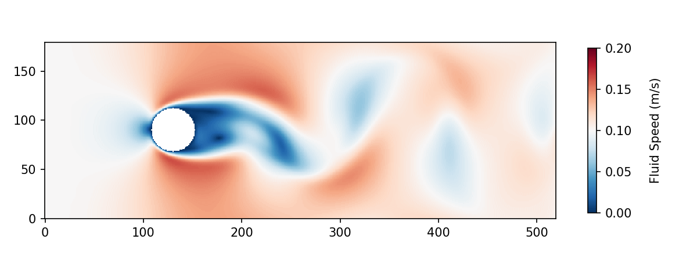

# Modelling Von Karman Vortices in Parallel by the Lattice Boltzmann Method
## Oliver Chapman
### 31/03/2019

#### Abstract

Modelling fluids is a difficult task. It is computationally intensive, mathematically complex and expresses rich behaviours which are often hard to examine computationally. This code is designed to model Von Karman Vortices - an observable phenomenon which results in rhythmic oscilaltions from a randomly perturbed inital state.



Figure 1: This gif shows the velocity in m/s of a fluid passing a circular boundary. The initial state is comprised of random fluctuations around 0.1 m/s which eventually lead to the Von Karman Vortices observed thereafter.


This code also seeks to demonstrate the Message Passing Interface (MPI) which allows tasks to be distributed amongst several computational units to be run in parallel. With the aid of the highest level of optimisation provided by gcc, this parallelised C code is capable of running 1,000 to 10,000 faster than similar python code. Parallelisation is therefore a very powerful tool for physics simulations.

The underlying solution demonstrates a method for increasing the runtime of Non-Linear Partial Differential Equations by using localised techniques. By splitting the problem into distinct regions, the problem can be calculated in parallel.


#### Installation Notes

This project was created and written on Linux, and run on the Bluecrystal supercomputer at the University of Bristol.

The code is divided into two files:
1. `vortex_mpi.c` - This file contains the C code which runs the LBM simulation and outputs `.bin` files which contain density (rho) and velocity (vel) snapshots.
2. `bin_to_png.py` - This file contains python code which creates the individual frames seen in the gif above.

#### Compiling

To compile with the greatest level of optimisation the `-O3` option is used:

```mpicc vortex_mpi.c -lm -O3 -march=native -std=c99 -o mpi.out```

Then to run the code use `mpiexec` with the number of parallel threads given by `-n 2`:

```mpiexec ./mpi.out -n 2```
